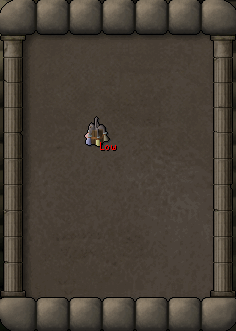

# Chugging Barrel

This plugin brings quality-of-life (QoL) improvements to the Chugging Barrel.

## Features

- Adds load-outs names to the barrel interface.
- Shows the name of the current load-out over the item.
- Indicates when any potion doses fall below a configured threshold.
- Reminds you to bank the barrel after drinking.

## Usage

- Load-outs can be renamed by clicking on their names in the barrel's bank interface.
- The name of the load-out selected using the **Load** button is displayed over the Chugging barrel item.
- Clicking the **Deposit Potions** button clears the selected load-out.

## Screenshots

&nbsp;&nbsp;
&nbsp;&nbsp;

## Contribute

For feature suggestions or bug reports, feel free
to [open an issue](https://github.com/Syhlex/chugging-barrel/issues/new).
