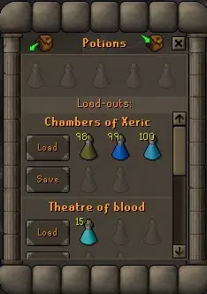
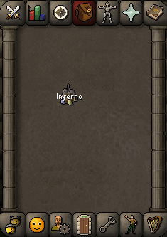

# Chugging Barrel

This plugin brings quality-of-life (QoL) improvements to the Chugging Barrel.

## Features

- Adds load-outs names to the barrel interface.
- Adds an item overlay with the name of the current load-out.

## Usage

Load-outs can be renamed by clicking on their names in the barrel interface.

The name of the load-out selected using the **Load** button is displayed over the Chugging barrel item. 
Only the first 7 characters are shown due to limited space. 

Clicking the **Deposit Potions** button clears the selected load-out.
